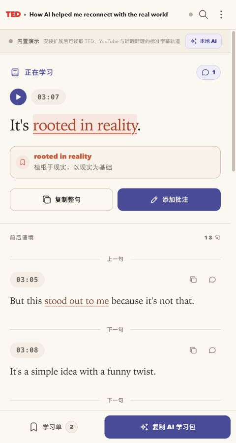
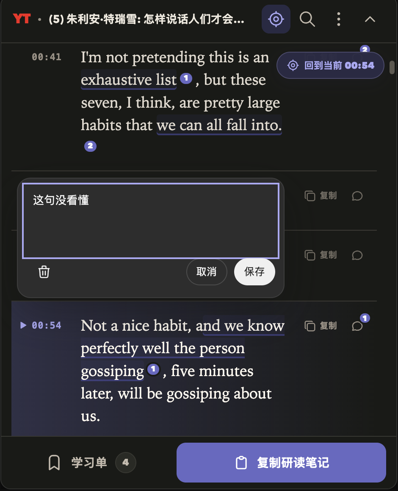
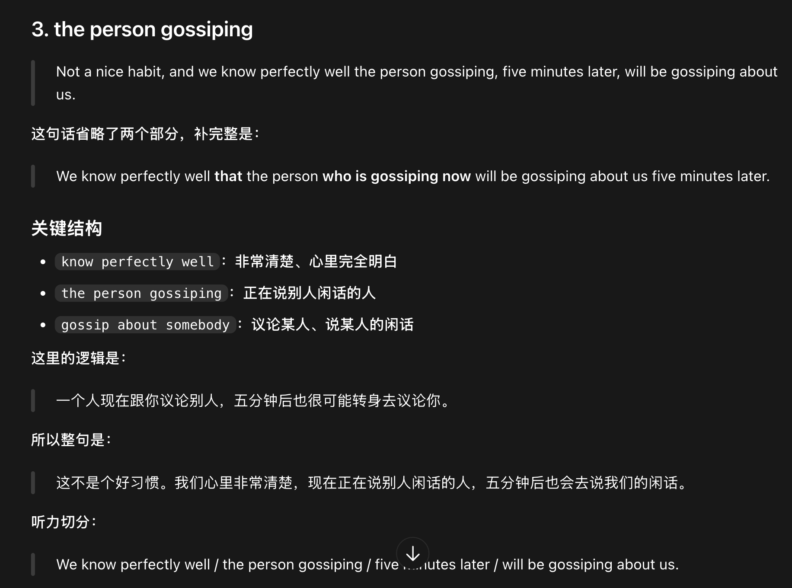

# Captiono

<p align="center">
  <strong>Turn YouTube and Bilibili captions into a navigable, highlightable, and annotatable language-learning transcript.</strong>
</p>

<p align="center">
  <a href="./README.md">简体中文</a> · English
</p>

<p align="center">
  <a href="https://github.com/TD21forever/captiono/releases/latest"></a>
  
  
</p>

<p align="center">
  
</p>

Captiono is a Chrome extension that lives in the native sidebar of supported video pages.
When you open a captioned YouTube or Bilibili video, it automatically turns the available
captions into a compact, continuous study transcript. Follow playback, jump by timestamp,
save expressions, add annotations, and export your notes as Markdown or JSON.

<p align="center">
  
</p>
<p align="center"><sub>Real dark-mode workflow with useful phrases, precise text annotations, annotation counts, and playback following.</sub></p>

## Highlights

- **Automatic captions** — loads available captions after page load and in-site video navigation.
- **Playback following** — pauses while you browse, returns the active sentence to roughly the top third after 8 seconds of complete inactivity, or lets you return with one click.
- **Useful phrases** — highlights reusable English expressions with deterministic local rules and shows Chinese contextual glosses on hover.
- **Inline annotations** — attach questions, saved expressions, or learning notes to a sentence or exact text selection.
- **Fast reuse** — copy a selection, sentence, full transcript, or study notes, continue in your preferred AI, and export Markdown or JSON.
- **Per-video storage** — separates captions, phrases, and annotations by video and browser tab.
- **Native-page module** — participates in the YouTube or Bilibili sidebar layout instead of covering the player or page controls.
- **Light and dark themes** — follow the system appearance or choose a theme manually.

## Bring your notes to your AI

Captiono turns selected transcript excerpts, timestamps, and annotations into copy-ready study
material. Click **Copy Study Notes**, then paste the result into Codex, ChatGPT, or another AI
to explore omitted grammar, key phrases, sentence logic, contextual translation, and listening
chunks.

<p align="center">
  
</p>
<p align="center"><sub>An AI uses the original sentence and learning context prepared by Captiono to reconstruct omitted grammar and explain key expressions.</sub></p>

This handoff is initiated by the user. Captiono captures and structures the learning material,
but never sends captions or annotations to an AI service automatically; the analysis comes from
the external AI you choose.

## Install

The Chrome Web Store listing is being prepared. For now, install the GitHub Release build:

1. Download `captiono-1.6.2.zip` from [Releases](https://github.com/TD21forever/captiono/releases/latest).
2. Unzip the archive.
3. Open `chrome://extensions` and enable **Developer mode**.
4. Click **Load unpacked** and select the extracted `captiono-1.6.2` folder.
5. Open a captioned YouTube or Bilibili video.

When updating an unpacked installation, reload Captiono on the Extensions page and then
refresh any already-open video tabs. See [INSTALL.md](./INSTALL.md) for the full checklist.

## Platform support

| Platform | Caption source | Status |
| --- | --- | --- |
| YouTube | Page caption manifests and temporary caption resources minted by the player | Supported |
| Bilibili | Player caption manifests and platform caption JSON | Supported |

Captiono only reads captions already provided by the platform. It does not capture tab audio,
run speech recognition, or maintain a private caption database. Videos without captions remain
unsupported. See [SUBTITLE-ARCHITECTURE.md](./SUBTITLE-ARCHITECTURE.md) for provider details.

## Privacy

- Captiono has no caption backend and includes no analytics or advertising SDK.
- Captions come directly from the current YouTube/Bilibili page and platform caption endpoints.
- Captions, saved phrases, annotations, and preferences stay in local Chrome extension storage.
- Captiono does not request `tabCapture`, microphone, or `offscreen` permissions.
- Temporary signed caption URLs are never persisted, logged, or exported.

Read the full [Privacy Policy](./PRIVACY.md).

## Development

```sh
npm install
npm run dev
```

Build the unpacked Chrome extension and release archive:

```sh
npm run build:extension
```

The unpacked build is written to `dist/extension`; the release archive is written to
`dist/captiono-1.6.2.zip`.

## Verification

```sh
npm test
npm run build:extension
```

The test suite covers caption providers, sentence merging, playback following, phrase analysis,
annotations, persistence, exports, and extension packaging. See [CHANGELOG.md](./CHANGELOG.md)
for release history.

## Feedback

If a video cannot load captions or Captiono interferes with the host-page layout, please open an
[issue](https://github.com/TD21forever/captiono/issues) with the video URL, platform, and a screenshot.
